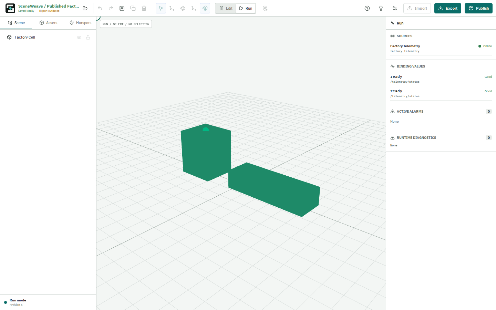

# SceneWeave

**Open-source, self-hosted 3D scene editor and runtime for data-driven Three.js experiences, digital twins, IoT visualization, and embeddable WebGL viewers.**

<p>
  <a href="https://github.com/Gujiassh/sceneweave/actions/workflows/ci.yml"></a>
  <a href="LICENSE"></a>
  <a href="https://threejs.org/"></a>
  <a href="https://react.dev/"></a>
</p>

SceneWeave turns existing glTF/GLB models into interactive web applications. Import and arrange a scene, map stable 3D targets to business data, express visual states as declarative rules, validate the result in Studio Run mode, and publish the same versioned scene to a framework-neutral or React host.



## Why SceneWeave

General-purpose 3D editors focus on content creation. Enterprise digital-twin platforms often require a cloud stack or a domain-specific backend. SceneWeave covers the layer between them: turning prepared 3D assets and application data into a portable, self-hosted web experience.

- **Author and run in one Studio:** edit hierarchy, transforms, lighting, hotspots, mappings, and rules without switching applications.
- **Bind scenes to data:** connect stable targets to Mock data or host-provided adapters, then visualize ready, offline, alarm, color, visibility, label, and animation states.
- **Keep scenes portable:** store authored intent in a validated `SceneDocument`; keep credentials, live values, selection, alarms, and host UI state out of persisted files.
- **Embed without framework lock-in:** use the framework-neutral Three.js runtime directly or the thin React wrapper.
- **Own the deployment:** export deterministic static bundles that can be reviewed, cached, versioned, and self-hosted.

## Use Cases

- Industrial digital twins and equipment monitoring
- Smart-home and IoT device visualization
- Warehouses, campuses, facilities, and operations dashboards
- Interactive product, showroom, and spatial-data experiences
- Three.js prototypes that need a durable scene contract and an embeddable viewer

## Features

### 3D Scene Studio

- GLB and self-contained glTF import with validation and content-addressed storage
- Scene hierarchy, grouping, reparenting, duplicate, delete, visibility, and locking
- Translate, rotate, scale, snapping, alignment, undo, and redo
- Theme-aware backgrounds, environment lighting, and authored point/spot lights
- Precise surface hotspots with persisted content and declarative actions
- Local-first IndexedDB projects plus deterministic JSON and ZIP import/export

### Data-Driven Runtime

- Versioned `SceneDocument 1.4.0` with standalone schema and semantic validation
- Stable target resolution by asset SHA-256 and glTF node index
- Snapshot/Patch ordering, stale and offline state, alarms, diagnostics, and recovery
- Declarative rules for color, visibility, labels, alarms, and animation
- Selection, focus, WebGL context restoration, and explicit resource disposal

### Publish And Embed

- Deterministic published-scene bundles and manifests
- Framework-neutral ESM runtime for plain TypeScript/JavaScript hosts
- React lifecycle wrapper and imperative viewer API
- Static hosting model with no required SceneWeave backend
- Reproducible package, asset, browser, and performance verification

## Quick Start

Prerequisites: Node.js `>=22.12.0` and pnpm `10.33.4`.

```bash
git clone https://github.com/Gujiassh/sceneweave.git
cd sceneweave
pnpm install --frozen-lockfile
pnpm dev
```

Open <http://localhost:4173>. Studio requires a desktop viewport at least 1280 px wide. The development server uses strict port `4173` and exits instead of silently choosing another port.

### Smart-Home Starter

The clean-profile reference project can be generated from the separately delivered owner assets:

```bash
node scripts/smart-home/generate.mjs \
  --mode local-validation \
  --output /home/cc/tmp/sceneweave-smart-home-starter
ln -sfn /home/cc/tmp/sceneweave-smart-home-starter apps/studio/public/starter
pnpm dev
```

Unlicensed local output is deliberately restricted to `/home/cc/tmp`. Public generation requires a hash-bound redistribution authorization and fails closed without it. Existing IndexedDB projects and explicit **New Scene** behavior are unchanged by starter bootstrap.

## Packages

The product is branded SceneWeave. The `@web3d/*` package scope remains the frozen `0.1.0-rc.1` SDK contract.

| Package           | Purpose                                                                                                    |
| ----------------- | ---------------------------------------------------------------------------------------------------------- |
| `@web3d/document` | SceneDocument types, AJV validation, migration, commands, history, serialization, and archives             |
| `@web3d/runtime`  | Framework-neutral Three.js viewer, asset loading, data ordering, rules, authoring, and lifecycle ownership |
| `@web3d/react`    | React lifecycle and imperative API wrapper around the runtime                                              |
| `@web3d/publish`  | Deterministic publish bundles, manifests, and host loading contracts                                       |

## Architecture

```text
Studio (React)
  -> SceneDocument + local asset repository
  -> @web3d/runtime (Three.js)
  -> data adapters + declarative rules
  -> deterministic publish bundle
  -> plain TypeScript/JavaScript or React host
```

The Studio is the only product frontend. Runtime values and host business state remain separate from authored document bytes. See the [architecture guide](docs/architecture.md), [protocol guide](docs/protocols.md), [Viewer API](specs/001-product-foundation/contracts/viewer-api.md), and [publish specification](specs/008-publish-embed/spec.md).

## Repository Layout

- `apps/studio`: local Edit/Run workspace
- `packages/document`: scene contracts and deterministic archives
- `packages/runtime`: Three.js runtime and authoring engine
- `packages/react`: React integration
- `packages/publish`: static publishing and loading
- `scripts/smart-home`: hash-bound starter audit and generation
- `benchmarks/009-release-performance`: fixed release-load benchmark
- `examples/minimal-host`: framework-neutral embedding example
- `tests/fixtures`: deterministic CC0 test assets and scene contracts

## Verification

```bash
pnpm format:check
pnpm lint
pnpm typecheck
pnpm test
pnpm test:e2e
pnpm build
pnpm verify:docs
pnpm verify:i18n
pnpm verify:assets
pnpm verify:topology
pnpm verify:design
pnpm verify:packages
pnpm verify:smart-home
RELEASE_PERF_SMOKE=1 RELEASE_PERF_ALLOW_SOFTWARE=1 pnpm bench:release-009
```

GitHub CI runs the deterministic non-browser repository gates. Browser evidence uses isolated Studio and host servers and writes screenshots to ignored local artifact directories.

## Project Status

SceneWeave is an MVP release candidate at `0.1.0-rc.1`.

> Release candidate; external production claims blocked.

The implementation, package consumers, browser matrix, deterministic assets, and local smart-home reference flow are complete. Production release claims remain blocked by owner-asset redistribution authorization, reference Iris Xe performance evidence, stable Firefox and real Safari evidence, and qualifying external usability evidence. See [release readiness](docs/ssot/release-readiness.md) and the [Feature 009 acceptance matrix](specs/009-performance-usability-open-source/acceptance.md).

## Documentation

- [Product definition](docs/ssot/product-definition.md)
- [Product decisions](docs/ssot/product-decisions.md)
- [Brand and discovery](docs/ssot/brand-and-discovery.md)
- [Architecture](docs/architecture.md)
- [Data and runtime protocols](docs/protocols.md)
- [Smart-home tutorial](docs/tutorial-smart-home.md)
- [SceneDocument contract](specs/001-product-foundation/contracts/scene-document.md)
- [Archive manifest contract](specs/001-product-foundation/contracts/archive-manifest.md)
- [Data adapter contract](specs/001-product-foundation/contracts/data-adapter.md)
- [Publish and embed technical design](specs/008-publish-embed/technical-design.md)
- [Performance and release specification](specs/009-performance-usability-open-source/spec.md)

## Scope

SceneWeave imports prepared web 3D assets; it is not a browser modeling or CAD tool. The MVP does not include a managed cloud, accounts, multiplayer collaboration, physics, a game engine, or built-in PLC/OPC UA/MES gateways.

## Contributing And Security

Read [CONTRIBUTING.md](CONTRIBUTING.md) before opening a pull request. Report vulnerabilities through the private process in [SECURITY.md](SECURITY.md). The project also includes a [Code of Conduct](CODE_OF_CONDUCT.md) and [changelog](CHANGELOG.md).

## License

SceneWeave code is available under the [MIT License](LICENSE). The deterministic M0 fixture is CC0-1.0; see [its license](tests/fixtures/m0-factory/LICENSE-CC0.txt).

Owner-provided smart-home GLBs are not covered by the repository MIT license and are not tracked or released until a separate authorization identifies the copyright owner, license text, and exact covered hashes. Dependency notices are listed in [THIRD_PARTY_NOTICES.md](THIRD_PARTY_NOTICES.md).
